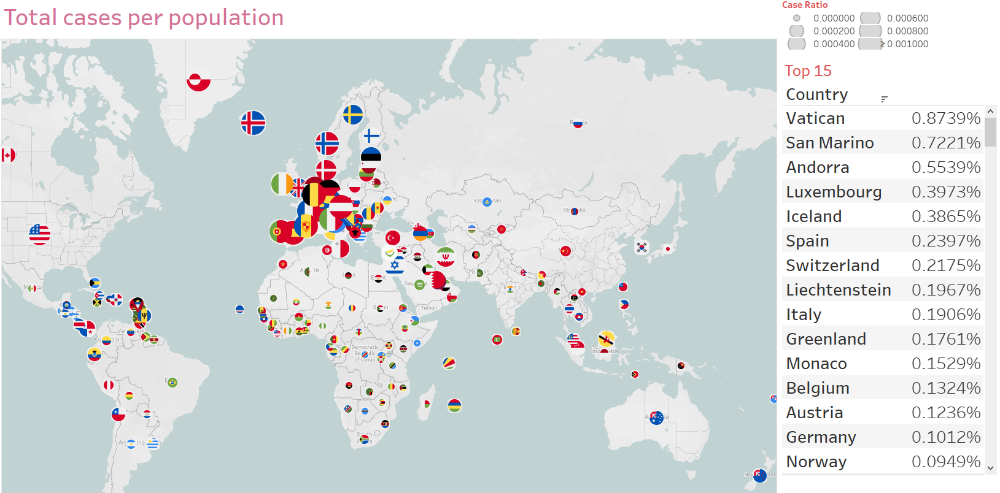
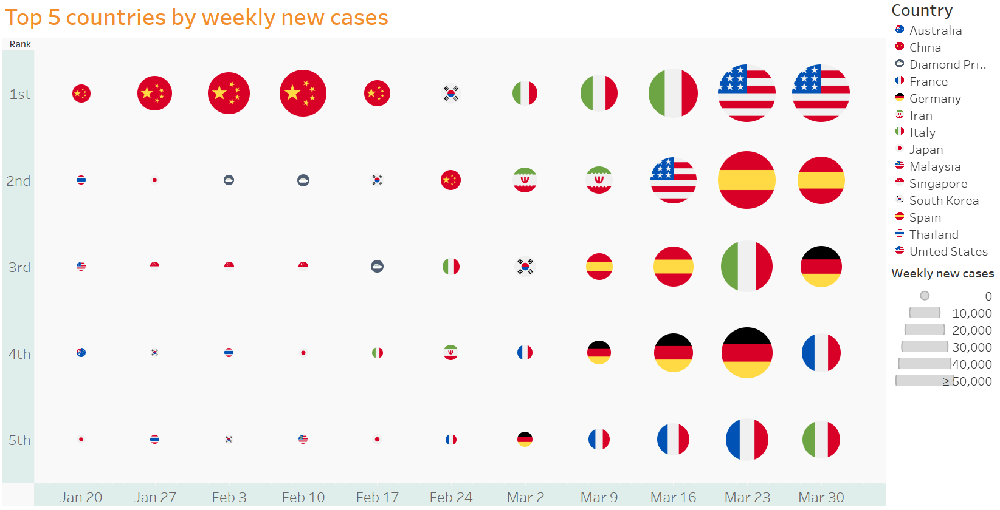
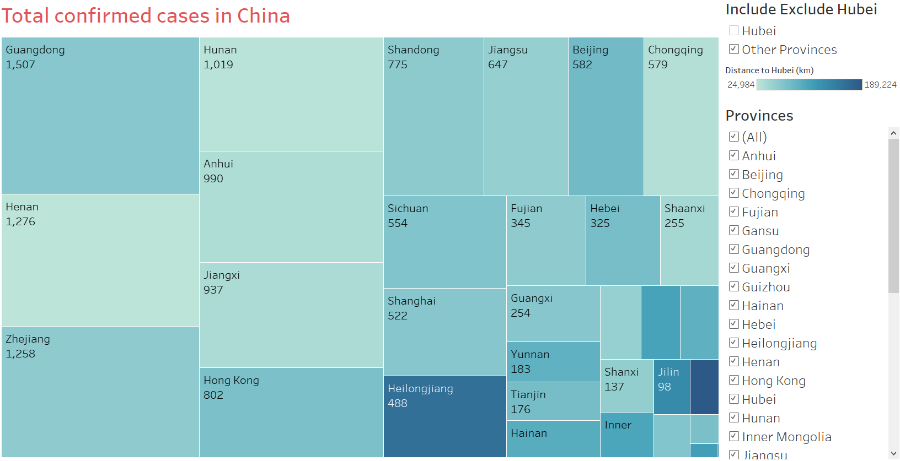
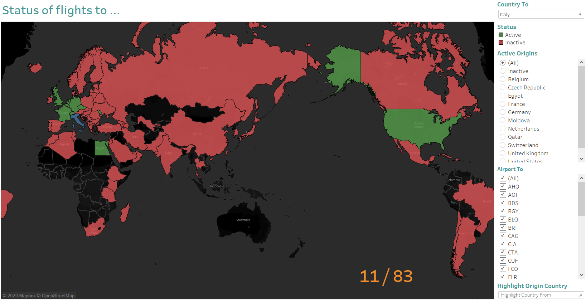
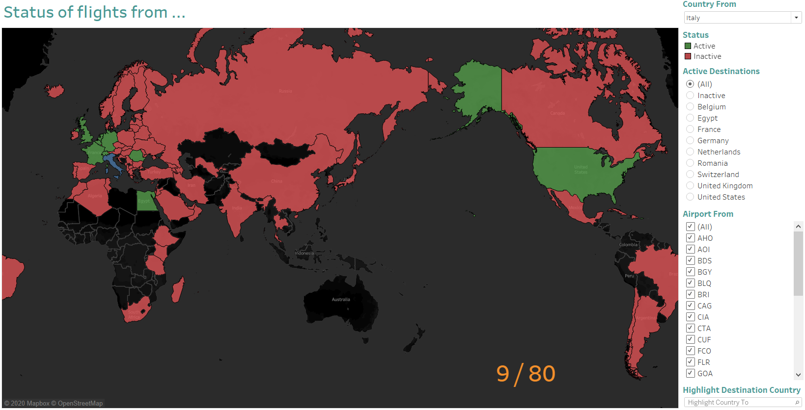
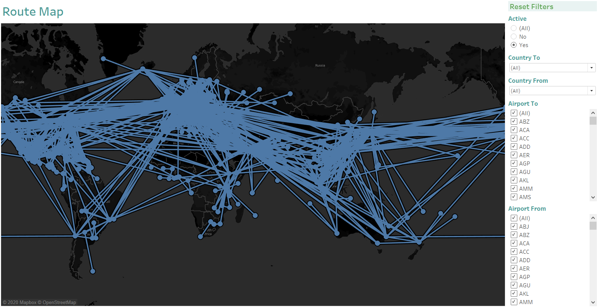
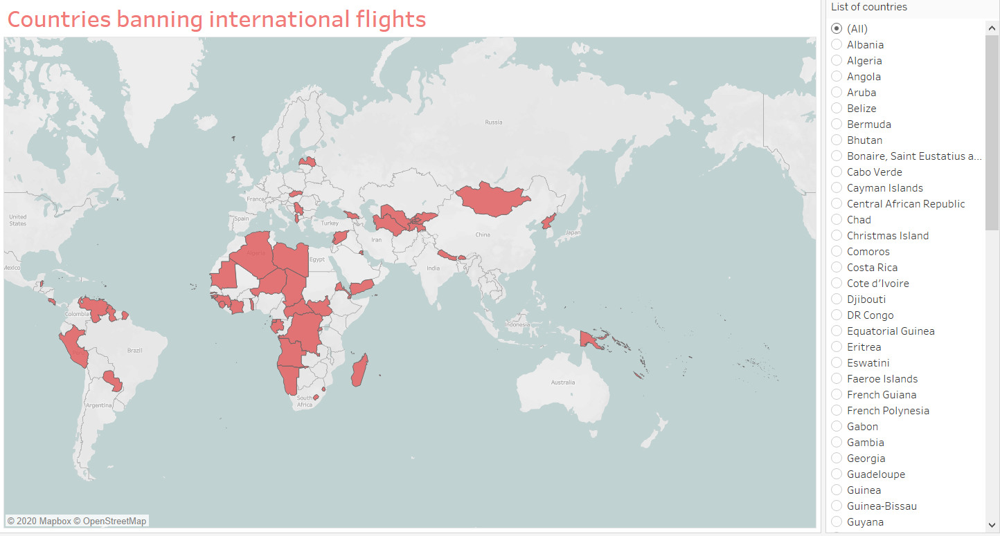
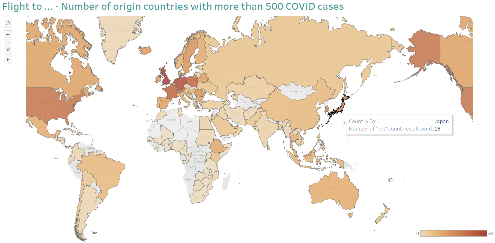

# Covid19

## Introduction
In this project, I used the John Hopkin University's dataset to analyze the Covid19 pandemic. Analysis was done using Python, and for the final product, I created a Tableau dashboard to monitor the situation.

main.py is run daily and the dashboard is updated accordingly.

The interactive dashboard can be viewed at
https://kruschev.github.io/covid19/dashboard.html

## Overview
Coronavirus disease 2019 (COVID-19) is a pandemic caused by the SARS-CoV-2 virus. Originated from Wuhan, it has spread to more than 180 countries and territories. The disease is extremely contagious and has seen exponential growth in many places. As more people are infected, the country's medical resources are strained and fatal cases are becomming more common. 

## Spread of the virus
So far we have seen two major phases of the pandemic. In the first phase, the outbreak is fairly contained within China. In the second phase, the outbreak in Italy initiated a widespread of the virus all over the world, especially in Europe. This could be due to the free movement policy between Schengen countries and the hesitation of governments to limit travel.

[Youtube link](https://youtu.be/ByEcDfw_1eE)

## Active cases around the world
China started first and recorded massive growth in confirmed cases during February. However, in recent weeks there have been very few new cases being reported, while the situation in Italy is still getting worse everyday.
[Youtube link](https://youtu.be/sVMa2_p2quA)

## A comparison between total cases and total deaths
[Youtube link](https://youtu.be/v5di4RjEam8)

## Total cases per population
Iceland, once again, is among the top performers with their small and vulnerable population. During 2009 H1N1, they were the country with highest confirmed case per capita.

## Estimating the real total cases number for different countries
An interesting debate during this pandemic is the hiding of information and lack of effort in testing people by some governments. Many speculate that the real number of infected people are much higher. Meanwhile, South Korea has been praised for its transparency level and for conducting the most tests on its citizens.

Since a country is less likely to hide death resulted from the virus, I attempted to use the country's death counts and South Korea's case fatality rate (cfr) to estimate the real number of infected population. 

In addition, I also used a dataset from DXY.cn, which contains information such as age on about 3000 patients. Since the virus has been known to attack mostly older people, I can run a simple regression model to determine the coefficient of age on fatality, and use that to adjust the cfr for each country. The country's age data was retrieved from UN publication.

After the adjustment, we can see a huge increase in some countries,for example China, Italy, Iran. However, considering that these countries were at some point overwhelmed with too many patients, it's also possible that their cfr could be much higher than average.

## Comparison of number of new cases between countries

## Ranking countries on number of new cases for each week

## Span of epidemic

## Breakdown of China provinces
This image shows the distribution of cases in China, without Hubei.

## Flight Routes Analysis
I also created another dashboard to track the status of international flight routes around the world. Viewers can select one country/airport and see which flight routes are still active for the next 10 days. The dashboard is located at https://kruschev.github.io/flight_status/flight.html

11 out of usual 83 countries can still fly to Italy.

Italy can still fly to 9 out of 80 usual countries. 

A map of active routes around the world.

A map of countries banning all international flights.

A map showing how many 'hot' countries (more than 500 COVID cases) can still fly to a certain country.

